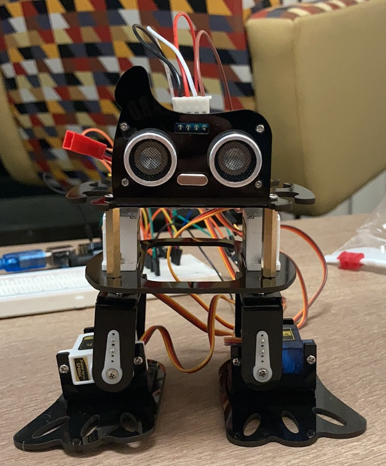
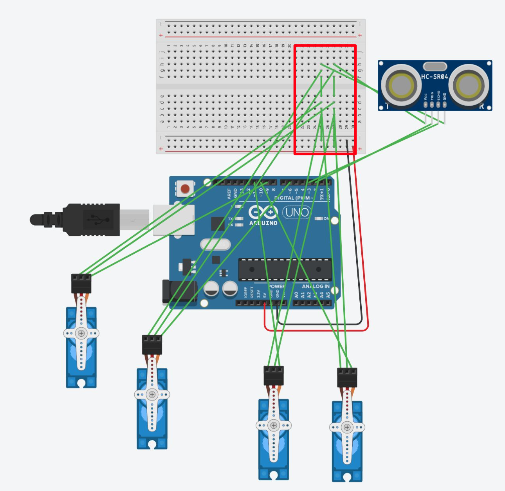

# Dancing Robot Project for ECE196
More detailed information can be found in the ***"Presentation with scripts"*** pdf file.  
There is a recording of the live demo of the presentation in the ***"Presentation with Demo"*** folder. (At the last page of the pdf)

## Contributors
| Main Author  | Assistant |
| ------------- | ------------- |
| Benny Cai  | Stella Zhang  |

**Goal**: build and program a dancing robot using ***Arduino C***.

The robot is able to:
- **dance** (code designed by SunFounder, not us)
- **move forward**, and **move backward** when it senses an obstacle within 5 cm (code designed by us)   

**Main components**: an Arduino UNO board, a breadboard, four micro-servos, and an ultrasonic distance sensor

